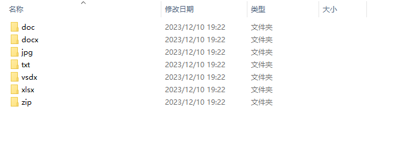

## TIDY 
### a efficient tool helps organizing your files !
#### feature
1. sort by time
2. sort by file type

#### usage
1. cmd

   ```
   tidy -h
   
   Usage of tidy.exe:
     -dir string
           please give new a directory name (default "new_directory")
     -path string
           please give your directory path
     -time_span string
           give a time span, for example: year,month,day,hour,minute,second (default "hour")
     -type string
           time: sort by time      file_type: sort by file_type (default "time")
   ```

2. code

   ```
   package main
   
   import (
   	"time"
   
   	tidy "github.com/arczhi/tidy/impl"
   	"github.com/arczhi/tidy/pkg/core"
   	"github.com/arczhi/tidy/pkg/constants"
   )
   
   func main() {
   
   	// sort by time
   	t, err := tidy.New("./your/directory", core.WithTimeSpan(constants.TIME_FORMAT_ACCURATE_TO_HOUR)
   	if err != nil {
   		panic(err)
   	}
   	if err := t.Exec(); err != nil {
   		panic(err)
   	}
   
   	// sort by file type
   	t2, err := tidy.New("./your/directory", core.WithFileType())
   	if err != nil {
   		panic(err)
   	}
   	if err := t2.Exec(); err != nil {
   		panic(err)
   	}
   }
   
   ```
   
   

#### example



